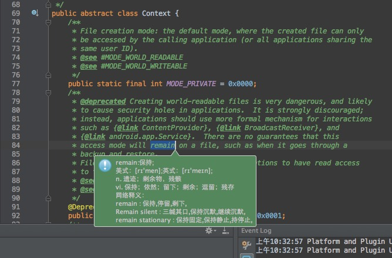

#ECTranslation

Android Studio 翻译插件,可以将英文翻译为中文.

##1.使用方法

- Clone项目,获取ECTranslation.jar.
- 打开Android Studio, Preferences -> Plugins -> Install plugin from disk -> 选择ECTranslation.jar安装并重启Android Studio.
- 选中代码,选择 Edit -> Translate或者按下 command + I(也可以自己设定).即可翻译,效果如下:

##2.修改快捷键

### 使用键盘快捷键触发
- Preferences -> Keymap -> 搜索Translate - > 右键 add Keyboard Shortcut. 输入你想要的快捷键即可。

### 使用鼠标触发(可以设置，但不建议设置，会影响侧边栏双击的功能)
- Preferences -> Keymap -> 搜索Translate - > 右键 add Mouse Shortcut. 设置你想触发的鼠标操作即可。但是目前不建议这样设置因为会影响侧边栏功能的使用。所以最好还是根据自己的习惯设置键盘快捷键。

##3.更新日志

###V1.3
- 去除对话框提示的icon。

###V1.2
- 增加翻译弹框显示的时间。
- 增加拆分单词翻译，现在支持类似：setContentView与ALIGN_CENTER的翻译了。

### V1.1
- 修复长按快捷键导致Android Studio无响应的问题。
- 重构代码。

### V1.0
- 1.0版本发布。实现基本功能。

##4.QA

1. Windows和Mac都可以使用吗？
  
  > 可以。

1. 翻译出现乱码怎么办？
  
  > [点击查看解决办法](https://github.com/Skykai521/ECTranslation/issues/6)。

##Thanks
- [有道翻译](http://fanyi.youdao.com/openapi?path=data-mode)
- [简单的Android Studio 翻译插件](http://blog.csdn.net/loucyin/article/details/50983172)
